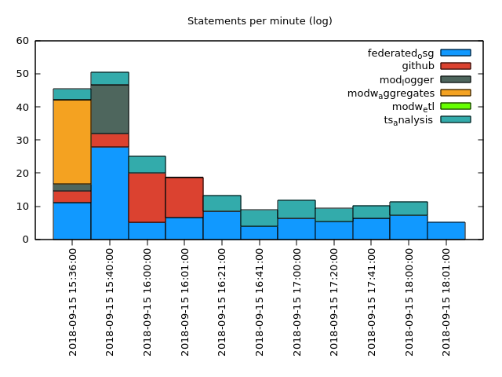

# MySQL Dev Tools

## mysql-parse-binlog-transactions

Parse one or more mysql binlogs to extract statement and commit information. Supports 3 modes:
- Summary mode (no options) with one line per statement
```
timestamp       table   stmt_type       stmt_count
2018-09-15 15:27:53     mod_logger.log_id_seq   INSERT  1
2018-09-15 15:27:53     mod_logger.log_id_seq   DELETE  1
2018-09-15 15:27:53     mod_logger.log_table    INSERT  1
2018-09-15 15:27:56     ts_analysis.accountfact UPDATE  1
2018-09-15 15:36:30     modw_aggregates.supremmfact_by_day_joblist      INSERT  250000
```
- Per table statistics with multiple contiguous operations on the same **table** collapsed into a
  single entry (`-t`)
```
start_timestamp end_timestamp   table   stmt_count      insert_count    update_count    delete_count    commit_count
2018-09-15 15:27:53     2018-09-15 15:27:53     mod_logger.log_id_seq   2       1       0       1       2
2018-09-15 15:27:56     2018-09-15 15:36:25     ts_analysis.accountfact 23      0       23      0       23
2018-09-15 15:40:10     2018-09-15 15:40:19     federated_osg.raw_jobs_test     173     173     0       0       173
```
- Per database statistics with multiple contiguous operations on the same **database** collapsed
  into a single entry (`-d`)
```
start_timestamp end_timestamp   seconds database        stmt_count      commit_count
2018-09-15 15:27:53     2018-09-15 15:27:56     3       mod_logger      9       9
2018-09-15 15:27:56     2018-09-15 15:36:25     509     ts_analysis     23      23
2018-09-15 15:36:33     2018-09-15 15:36:35     2       modw_aggregates 235722  2
2018-09-15 15:36:35     2018-09-15 15:36:35     0       mod_logger      21      21
2018-09-15 15:36:35     2018-09-15 15:36:35     0       modw_etl        1       1
```

## convert-parsed-binlogs-for-gnuplot

Convert data parsed by `mysql-parse-binlog-transactions` into a format suitable for plotting with
Gnuplot. This format is targeted towards generating a stacked histogram of database activity over
time with the data represented vertically and separated into one data series per database separated
by 2 newlines. This will allow Gnuplot to use "plot ... index n" to plot data where the x values are
different between data blocks.

```
plot for [s=0:words(series)-1:1] *datafile* index s using 3:xticlabels(2) title word(series, s+1) linestyle s+1
```

## mysql_binlog.gp

Gnuplot file for plotting stacked a histogram showing database activity.


